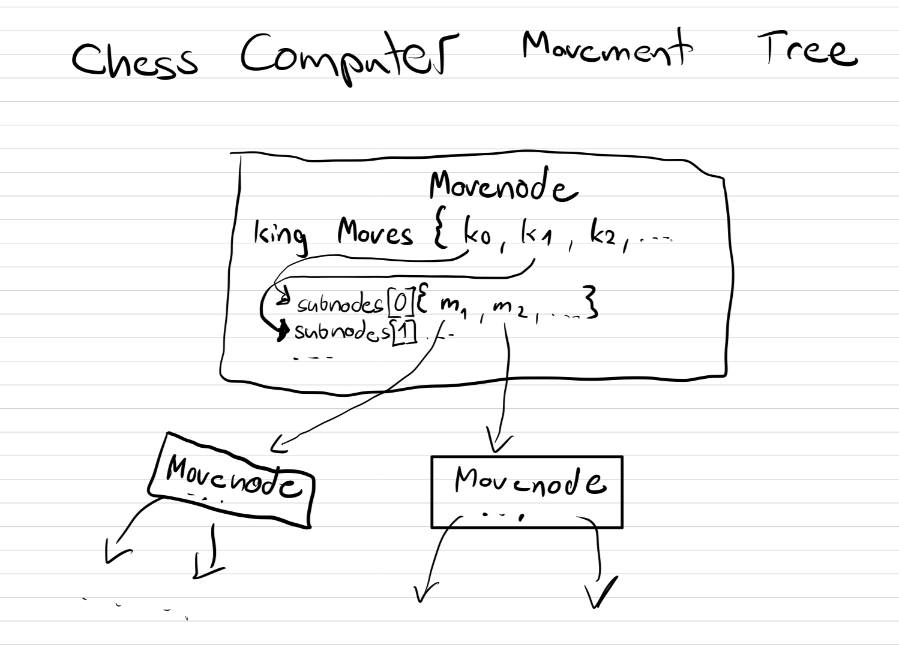
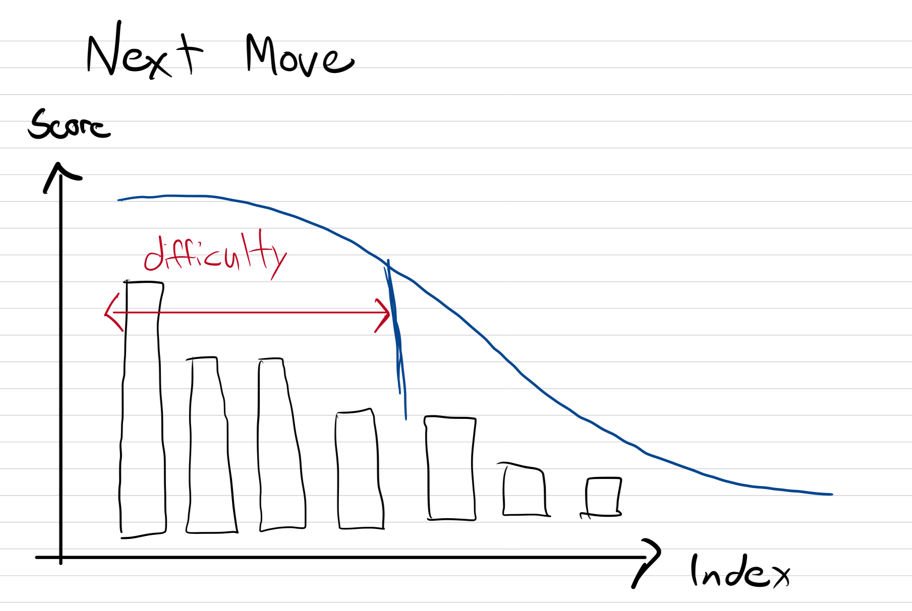

# Five Knight agains King Fredric

## Chess Computer

see: `Game/src/ChessComputer.h++` 

The Chess computer runs on a seperate thread and creates a movement Tree of all possible Moves.

It ranks them with a score function: $x^x$ with $x = $ `number of blocked king moves`. After that it sorts them and choses an move base on a normal Distributation.

## AI Manager

static Class that sits between the actual Game and the ChessComputer. It controls the Knights and comunicates with the PlayerMovement Script.

## GameManagerScript

script that controls the camera, follows the Player, and controls all UI elements.

## PlayerMovermentScript

script that controls and animates the player.

## KnightsScript

script that controls the knight and animates them.