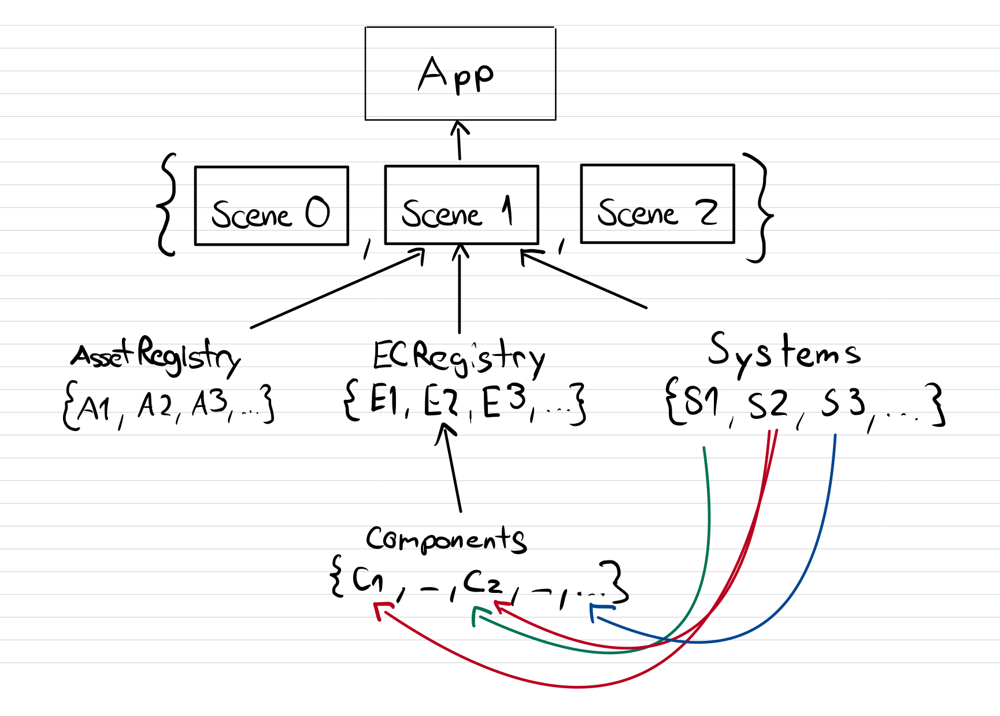
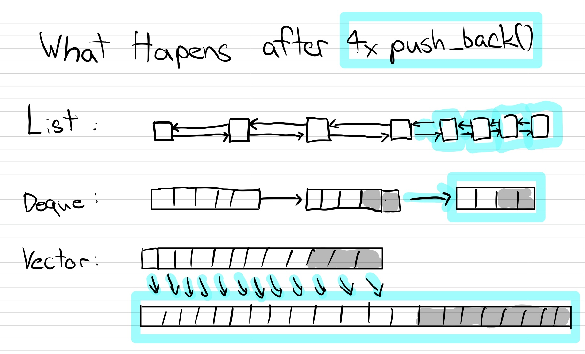

# Senpai Game Engine

The game engine I created is based on this book: [CROSS-PLATFORM 2D GAME WITH SDL2](https://www.amazon.com/dp/B09SWTG4DC)

The source code of the book is available here: https://github.com/Madsycode/book-fuse-engine

Senpai ist aber keine einfache Kopie!

However, Senpai is not just a simple copy!

Features such as multiple scenes, lighting, geometry, and cameras are just a few of the custom features and optimizations.

## How to use it

To run an app, one has to define Scenefunctions and push them into the `app.sceneLoaders`

```cpp
#include <cstdlib>

extern void load_loading_scene(Senpai::Scene* scenePtr);
extern void load_main_menu_scene(Senpai::Scene* scenePtr);
extern void load_game_scene(Senpai::Scene* scenePtr);

int main() {
   // create an app
   Senpai::App app;
   // set the app settings
   app.settings.fpsTarget = 30;
   // add the scenes to the app
   app.sceneLoaders.push_back(load_loading_scene);
   app.sceneLoaders.push_back(load_main_menu_scene);
   app.sceneLoaders.push_back(load_game_scene);
   // run the app
   app.run();
   // return 0 to the OS
   return 0;
}
```

## How it works

The app loads scenes via load functions.

Every scene consists of assets, entities, and systems. An entity, in turn, consists of multiple components that are updated by the systems.



## ECRegistry 

The Entity Component Registry contains all components and keeps track of which entity has which component.

## AssetsRegistry

The Assets Registry makes assets more accessible by id and name.

## Reference Safety

All assets, components, entities, and systems are stored in either lists or deques to ensure reference safety. If you take a reference or pointer to one of these objects, it will remain valid for the duration of the object's lifetime.



## Input Class

A static class that provides easy access to events and input.

See: `Senpai/core/Inputs.h++`

## EventDispatcher

Contains callback functions and calls them when a specific event occurs.

See: `Senpai/core/Event.h++`